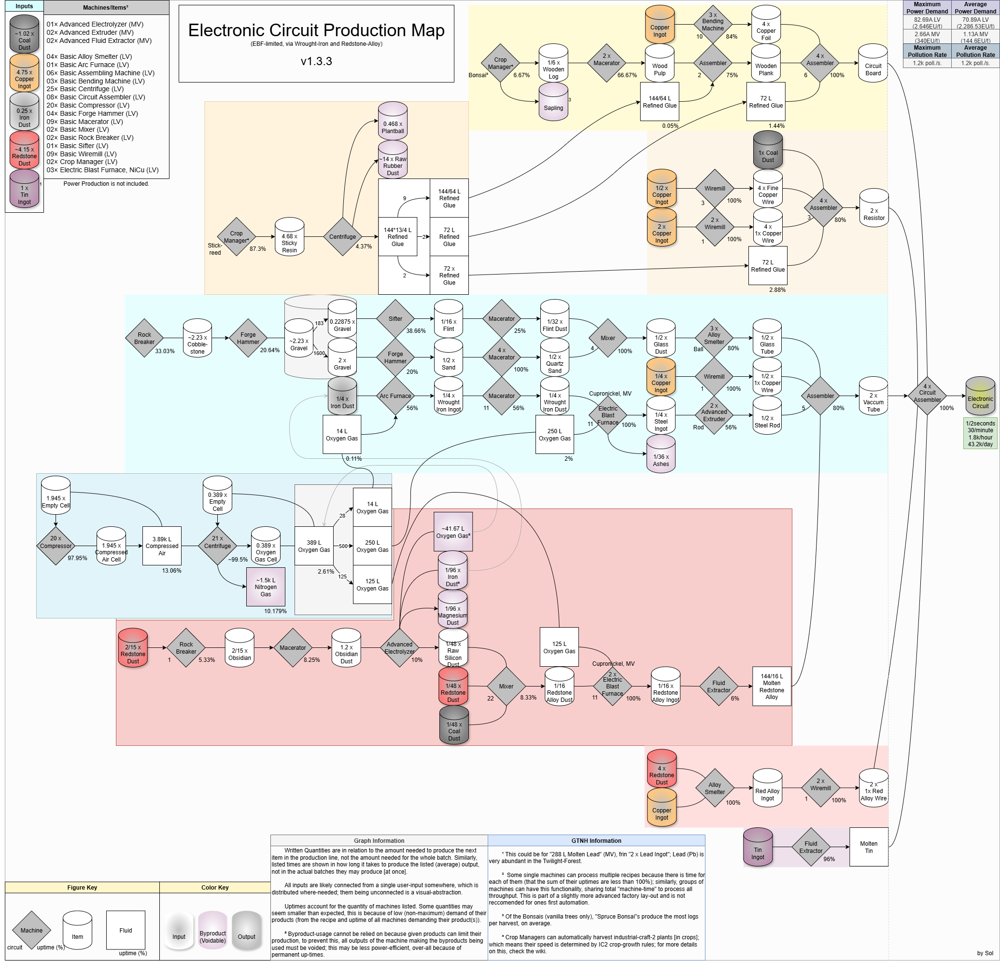

# Production Map

---

### Example Map


This program is used to make readable Production-lines as inverted Trees, interpreted as inputs/outputs between machines. This tree can be used to \[manually\] produce images of Production-Lines.

---

### Example Output

```java
//"Input"
public class Main {
    public static void main(String[] args) {
        System.out.println( Maps.ELECTRONIC_CIRCUIT );
    }
}
```

<details>
  <summary># Sub-System Production-Lines</summary>
    <pre style="font-family: monospace; line-height: 0.5rem; margin: 0;">
    1.0 Sticky_resin = 3.0 Raw_rubber_dust + 0.1 Plant_ball + 0.6944 Refined_glue [1× Basic-Centrifuge]@4.37%<br>
    └ 1.0 Nothing = 1.0 Sticky_resin [1× Crop-Manager-Lv]@87.3%<br>
    <br>
    1.0 Copper_ingot = 2.0 1x_copper_wire [3× Basic-Wiremill, 1]@100.0%<br>
    └ 1.0 Manual = 1.0 Copper_ingot [Manual]<br>
    <br>
    1.0 Cobblestone = 1.0 Gravel [1× Basic-Forge-Hammer]@20.64%<br>
    └ 1.0 Nothing = 1.0 Cobblestone [1× Basic-Rock-Breaker]@33.03%<br>
    <br>
    1.0 Oxygen_cell = 1.0 Empty_cell + 1.0 Oxygen [1× Low-Voltage-Fluid-Tank]@2.61%<br>
    └ 1.0 Empty_cell + 10.0 Air = 1.0 Oxygen_cell + 3.9 Nitrogen [21× Basic-Centrifuge]@99.5%<br>
        ╞ 1.0 Compressed_air = 1.0 Empty_cell [1× Cycling]@26.12%<br>
        ╘ 1.0 Compressed_air = 1.0 Empty_cell + 2.0 Air [1× Low-Voltage-Fluid-Tank]@13.06%<br>
            ╙ 1.0 Empty_cell = 1.0 Compressed_air [20× Basic-Compressor]@97.95%<br>
                ╚ 1.0 Compressed_air = 1.0 Empty_cell [2× Cycling]@65.3%
    </pre>
</details>
<details>
  <summary># Main Production-Line</summary>
    <pre style="font-family: monospace; line-height: 0.5rem; margin: 0;">
    1.0 Circuit_board + 2.0 Resistor + 2.0 1x_red_alloy_wire + 2.0 Vacuum_tube + 2.0 Molten_lead = 1.0 Electric_circuit [4× Basic-Circuit-Assembler]@100.0%<br>
    ├ 8.0 Wood_plank + 32.0 Copper_foil + 4.0 Refined_glue = 8.0 Circuit_board [4× Basic-Assembling-Machine, 6]@100.0%<br>
    │	╞ 64.0 Wood_pulp + 1.0 Refined_glue = 64.0 Wood_plank [1× Basic-Assembling-Machine, 2]@75.0%<br>
    │	│	╟ 1.0 Any_log = 6.0 Wood_pulp [2× Basic-Macerator]@66.67%<br>
    │	│	║	╚ 1.0 Nothing = 1.0 Any_log [1× Crop-Manager-Lv]@6.67%<br>
    │	│	╙ 1.0 Sticky_resin = 3.0 Raw_rubber_dust + 0.1 Plant_ball + 0.6944 Refined_glue [Consolidated-Branch]@0.05%<br>
    │	╞ 1.0 Copper_ingot = 4.0 Copper_foil [3× Basic-Bending-Machine, 10]@84.0%<br>
    │	│	╙ 1.0 Manual = 1.0 Copper_ingot [Manual]<br>
    │	╘ 1.0 Sticky_resin = 3.0 Raw_rubber_dust + 0.1 Plant_ball + 0.6944 Refined_glue [Consolidated-Branch]@1.44%<br>
    ├ 1.0 Coal_dust + 4.0 Fine_copper_wire + 4.0 1x_copper_wire + 2.0 Refined_glue = 4.0 Resistor [4× Basic-Circuit-Assembler, 3]@80.0%<br>
    │	╞ 1.0 Manual = 1.0 Coal_dust [Manual]<br>
    │	╞ 1.0 Copper_ingot = 4.0 Fine_copper_wire [1× Basic-Wiremill, 3]@100.0%<br>
    │	│	╙ 1.0 Manual = 1.0 Copper_ingot [Manual]<br>
    │	╞ 1.0 Copper_ingot = 2.0 1x_copper_wire [Consolidated-Branch, 1]@100.0%<br>
    │	╘ 1.0 Sticky_resin = 3.0 Raw_rubber_dust + 0.1 Plant_ball + 0.6944 Refined_glue [Consolidated-Branch]@2.88%<br>
    ├ 1.0 Red_alloy_ingot = 2.0 1x_red_alloy_wire [2× Basic-Wiremill, 1]@100.0%<br>
    │	╘ 1.0 Copper_ingot + 4.0 Redstone_dust = 1.0 Red_alloy_ingot [1× Basic-Alloy-Smelter]@100.0%<br>
    │	 	╟ 1.0 Manual = 1.0 Copper_ingot [Manual]<br>
    │	 	╙ 1.0 Manual = 1.0 Redstone_dust [Manual]<br>
    ├ 4.0 Glass_tube + 4.0 1x_copper_wire + 4.0 Steel_rod + 0.5 Molten_redstone_alloy = 8.0 Vacuum_tube [1× Basic-Assembling-Machine, 5]@80.0%<br>
    │	╞ 1.0 Glass_dust = 1.0 Glass_tube [3× Basic-Alloy-Smelter, Ball]@80.0%<br>
    │	│	╙ 1.0 Flint_dust + 16.0 Quartz_sand = 16.0 Glass_dust [1× Basic-Mixer, 4]@100.0%<br>
    │	│	 	╠ 2.0 Flint = 1.0 Flint_dust [1× Basic-Macerator]@25.0%<br>
    │	│	 	║	└ 1.0 Gravel = 3.88 Flint [1× Basic-Sifter]@38.66%<br>
    │	│	 	║	 	╘ 1.0 Cobblestone = 1.0 Gravel [Consolidated-Branch]@0.64%<br>
    │	│	 	╚ 1.0 Sand = 1.0 Quartz_sand [4× Basic-Macerator]@100.0%<br>
    │	│	 	 	└ 1.0 Gravel = 1.0 Sand [1× Basic-Forge-Hammer]@20.0%<br>
    │	│	 	 	 	╘ 1.0 Cobblestone = 1.0 Gravel [Consolidated-Branch]@20.0%<br>
    │	╞ 1.0 Copper_ingot = 2.0 1x_copper_wire [Consolidated-Branch, 1]@100.0%<br>
    │	╞ 1.0 Steel_ingot = 2.0 Steel_rod [2× Advanced-Extruder, Rod]@56.0%<br>
    │	│	╙ 1.0 Wrought_iron_dust + 1.0 Oxygen = 1.0 Steel_ingot + 0.1111 Ashes [1× Electric-Blast-Furnace-Lv-Nicu, 11]@100.0%<br>
    │	│	 	╠ 1.0 Wrought_iron_ingot = 1.0 Wrought_iron_dust [1× Basic-Macerator, 11]@56.0%<br>
    │	│	 	║	└ 1.0 Iron_dust + 0.056 Oxygen = 1.0 Wrought_iron_ingot [1× Basic-Arc-Furnace]@56.0%<br>
    │	│	 	║	 	╞ 1.0 Manual = 1.0 Iron_dust [Manual]<br>
    │	│	 	║	 	╘ 1.0 Oxygen_cell = 1.0 Empty_cell + 1.0 Oxygen [Consolidated-Branch]@0.11%<br>
    │	│	 	╚ 1.0 Oxygen_cell = 1.0 Empty_cell + 1.0 Oxygen [Consolidated-Branch]@2.0%<br>
    │	╘ 1.0 Redstone_alloy_ingot = 1.0 Molten_redstone_alloy [1× Advanced-Fluid-Extractor]@6.0%<br>
    │	 	╙ 1.0 Redstone_alloy_dust + 1.0 Oxygen = 1.0 Redstone_alloy_ingot [2× Electric-Blast-Furnace-Lv-Nicu, 11]@100.0%<br>
    │	 	 	╠ 1.0 Redstone_dust + 1.0 Raw_silicon_dust + 1.0 Coal_dust = 3.0 Redstone_alloy_dust [1× Basic-Mixer, 22]@8.33%<br>
    │	 	 	║	├ 1.0 Manual = 1.0 Redstone_dust [Manual]<br>
    │	 	 	║	├ 12.0 Obsidian_dust = 1.0 Magnesium_dust + 1.0 Iron_dust + 2.0 Raw_silicon_dust + 8.0 Oxygen [1× Advanced-Electrolyzer]@10.0%<br>
    │	 	 	║	│	╘ 1.0 Obsidian = 12.0 Obsidian_dust [1× Basic-Macerator]@8.25%<br>
    │	 	 	║	│	 	╙ 1.0 Redstone_dust = 1.0 Obsidian [1× Basic-Rock-Breaker, 1]@5.33%<br>
    │	 	 	║	│	 	 	╚ 1.0 Manual = 1.0 Redstone_dust [Manual]<br>
    │	 	 	║	└ 1.0 Manual = 1.0 Coal_dust [Manual]<br>
    │	 	 	╚ 1.0 Oxygen_cell = 1.0 Empty_cell + 1.0 Oxygen [Consolidated-Branch]@0.5%<br>
    └ 1.0 Lead_ingot = 1.0 Molten_lead [1× Advanced-Fluid-Extractor]@96.0%<br>
        ╘ 1.0 Manual = 1.0 Lead_ingot [Manual]
    </pre>
</details>
<details>
  <summary># Additional Details</summary>
    <pre style="font-family: monospace; line-height: 0.5rem; margin: 0;">
    ## Maximum Power Consumption<br>
     ├82.69A LV (2646.0 EU/t)<br>
     └2.66A MV (340.0 EU/t)<br>
    ## Average Power Consumption<br>
    ├70.89A LV (2268.53 EU/t)<br>
    └1.13A MV (144.6 EU/t)<br><br>
    ## Maximum Pollution Rate<br>
    └ 1200.0 pollution/second<br>
    ## Average Pollution Rate<br>
    └ 1200.0 pollution/second<br><br>
    ## Machines<br>
     ├ 1× Advanced-Electrolyzer (MV)<br>
     ├ 2× Advanced-Extruder (MV)<br>
     ├ 2× Advanced-Fluid-Extractor (MV)<br>
     ├ 4× Basic-Alloy-Smelter (LV)<br>
     ├ 1× Basic-Arc-Furnace (LV)<br>
     ├ 6× Basic-Assembling-Machine (LV)<br>
     ├ 3× Basic-Bending-Machine (LV)<br>
     ├ 4× Basic-Centrifuge (LV)<br>
     ├ 8× Basic-Circuit-Assembler (LV)<br>
     ├ 4× Basic-Forge-Hammer (LV)<br>
     ├ 9× Basic-Macerator (LV)<br>
     ├ 2× Basic-Mixer (LV)<br>
     ├ 2× Basic-Rock-Breaker (LV)<br>
     ├ 1× Basic-Sifter (LV)<br>
     ├ 9× Basic-Wiremill (LV)<br>
     ├ 2× Crop-Manager-Lv (LV)<br>
     └ 3× Electric-Blast-Furnace-Lv-Nicu (LV)<br>
    </pre>
</details>

---

### Features:
- Automatically generates Manufacturing-Process for a Product.
- Discovers \[and separates\] common sub-processes into separate lines (minimum-depth is configurable).
- Calculates uptimes of entire Manufacturing-Process.

### Planned Features:
- Product-input Information (manual inputs for producing one (1) product).
- Reformatting Machines such that there can exist multiple implementations for different systems of Machines.
- Multi-location inputs (by priority); maybe allowing for useful byproducts to be utilized.

### Known Bug(s):
- Multi-product sub-processes may overwrite an existing one.
