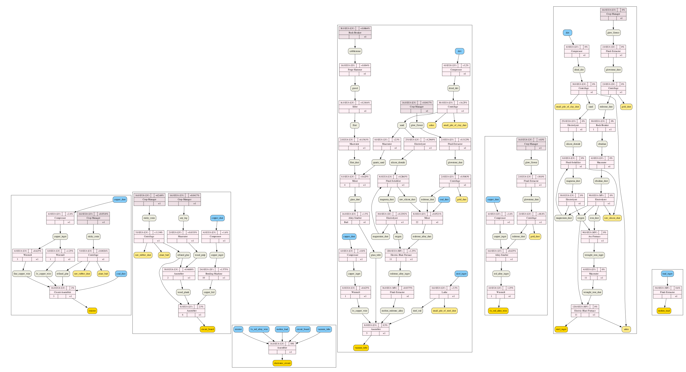
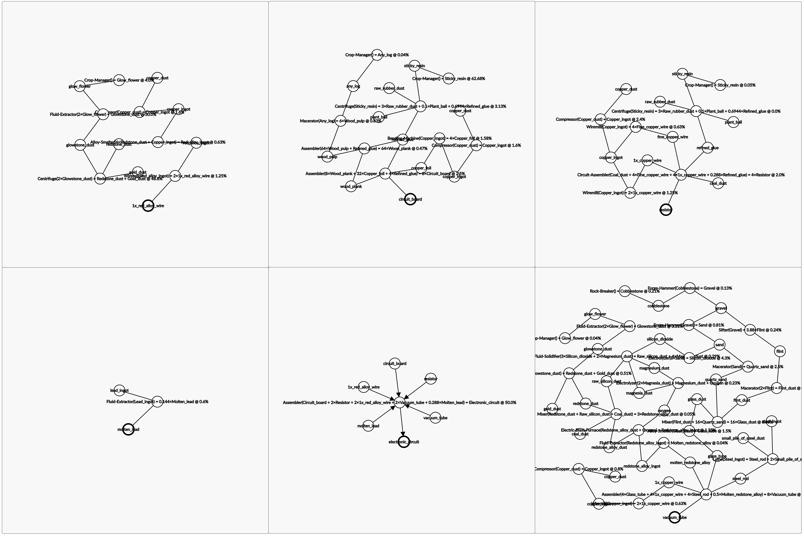
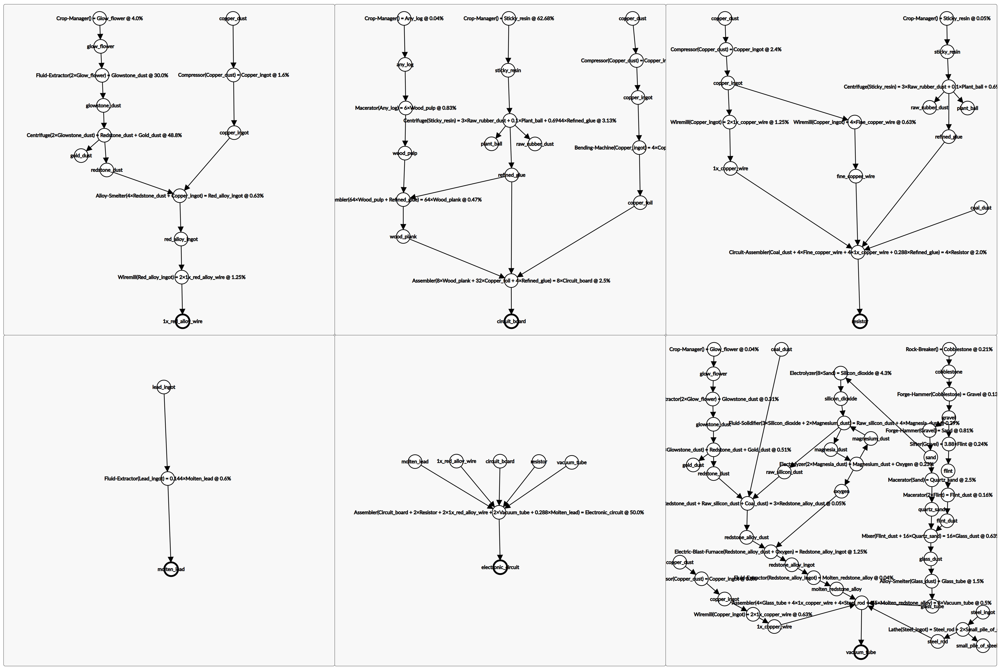

# Production Map

---

### Example Map

This program is used to make readable Production-lines as inverted Trees, interpreted as inputs/outputs between machines. This tree can be used to \[manually\] produce images of Production-Lines.

---

### Output Examples

##### [GraphViz](https://graphviz.org)

    
Graph (Electronic Circuit)

      <pre style="font-family: monospace; line-height: 1rem; margin: 0;">
      digraph {
	      compound=true
      </pre>
  

    
Main SubGraph (Electronic Circuit)

      <pre style="font-family: monospace; line-height: 1rem; margin: 0;">
      	subgraph cluster_main {
          p_main_a [shape=box, style="rounded,filled"fillcolor="gold"label="electronic_circuit", ]
          p_main_e [shape=box, style="rounded,filled"fillcolor="lightskyblue"label="vacuum_tube", ]
          p_main_b [shape=box, style="rounded,filled"fillcolor="lightskyblue"label="circuit_board", ]
          p_main_c [shape=box, style="rounded,filled"fillcolor="lightskyblue"label="resistor", ]
          p_main_d [shape=box, style="rounded,filled"fillcolor="lightskyblue"label="1x_red_alloy_wire", ]
          p_main_f [shape=box, style="rounded,filled"fillcolor="lightskyblue"label="molten_lead", ]
           
          t_main_a [shape=record, style="filled", fillcolor="lavenderblush", label="{ {16.0 EU/t (LV)||50%}|Assembler|{||×1} }"]
           
          p_main_b -> {t_main_a}
          p_main_c -> {t_main_a}
          p_main_d -> {t_main_a}
          p_main_e -> {t_main_a}
          p_main_f -> {t_main_a}
           
          t_main_a -> {p_main_a}
        }
      </pre>
  

  

    
First SubGraph (Circuit Board)

      <pre style="font-family: monospace; line-height: 1rem; margin: 0;">
      subgraph cluster_circuit_board {
        p_circuit_board_e [shape=box, style="rounded,filled"fillcolor="ivory2"label="wood_pulp", ]
        p_circuit_board_k [shape=box, style="rounded,filled"fillcolor="lightskyblue"label="copper_dust", ]
        p_circuit_board_g [shape=box, style="rounded,filled"fillcolor="ivory2"label="sticky_resin", ]
        p_circuit_board_a [shape=box, style="rounded,filled"fillcolor="gold"label="circuit_board", ]
        p_circuit_board_h [shape=box, style="rounded,filled"fillcolor="lightgoldenrod1"label="raw_rubber_dust", ]
        p_circuit_board_j [shape=box, style="rounded,filled"fillcolor="ivory2"label="any_log", ]
        p_circuit_board_b [shape=box, style="rounded,filled"fillcolor="ivory2"label="wood_plank", ]
        p_circuit_board_i [shape=box, style="rounded,filled"fillcolor="lightgoldenrod1"label="plant_ball", ]
        p_circuit_board_c [shape=box, style="rounded,filled"fillcolor="ivory2"label="copper_foil", ]
        p_circuit_board_d [shape=box, style="rounded,filled"fillcolor="ivory2"label="refined_glue", ]
        p_circuit_board_f [shape=box, style="rounded,filled"fillcolor="ivory2"label="copper_ingot", ]
         
        t_circuit_board_a [shape=record, style="filled", fillcolor="lavenderblush", label="{ {8.0 EU/t (LV)||2.5%}|Assembler|{6||×1} }"]
        t_circuit_board_f [shape=record, style="filled", fillcolor="lavenderblush", label="{ {4.0 EU/t (LV)||~1.6%}|Compressor|{||×1} }"]
        t_circuit_board_e [shape=record, style="filled", fillcolor="lavenderblush", label="{ {2.0 EU/t (LV)||~0.8333%}|Macerator|{||×1} }"]
        t_circuit_board_h [shape=record, style="filled", fillcolor="lavenderblush2", label="{ {16.0 EU/t (LV)||~0.0417%}|Crop-Manager|{||×1} }"]
        t_circuit_board_c [shape=record, style="filled", fillcolor="lavenderblush", label="{ {24.0 EU/t (LV)||~1.575%}|Bending-Machine|{10||×1} }"]
        t_circuit_board_g [shape=record, style="filled", fillcolor="lavenderblush2", label="{ {16.0 EU/t (LV)||~62.68%}|Crop-Manager|{||×1} }"]
        t_circuit_board_b [shape=record, style="filled", fillcolor="lavenderblush", label="{ {30.0 EU/t (LV)||~0.4688%}|Assembler|{2||×1} }"]
        t_circuit_board_d [shape=record, style="filled", fillcolor="lavenderblush", label="{ {5.0 EU/t (LV)||~3.134%}|Centrifuge|{||×1} }"]
         
        p_circuit_board_b -> {t_circuit_board_a}
        p_circuit_board_c -> {t_circuit_board_a}
        p_circuit_board_d -> {t_circuit_board_a,t_circuit_board_b}
        p_circuit_board_e -> {t_circuit_board_b}
        p_circuit_board_f -> {t_circuit_board_c}
        p_circuit_board_g -> {t_circuit_board_d}
        p_circuit_board_j -> {t_circuit_board_e}
        p_circuit_board_k -> {t_circuit_board_f}
         
        t_circuit_board_a -> {p_circuit_board_a}
        t_circuit_board_b -> {p_circuit_board_b}
        t_circuit_board_c -> {p_circuit_board_c}
        t_circuit_board_d -> {p_circuit_board_h,p_circuit_board_i,p_circuit_board_d}
        t_circuit_board_e -> {p_circuit_board_e}
        t_circuit_board_f -> {p_circuit_board_f}
        t_circuit_board_g -> {p_circuit_board_g}
        t_circuit_board_h -> {p_circuit_board_j}
      }
      </pre>
  

  

    
Second SubGraph (1x Red Alloy Wire)

      <pre style="font-family: monospace; line-height: 1rem; margin: 0;">
      subgraph cluster_1x_red_alloy_wire {
        p_1x_red_alloy_wire_e [shape=box, style="rounded,filled"fillcolor="ivory2"label="glowstone_dust", ]
        p_1x_red_alloy_wire_f [shape=box, style="rounded,filled"fillcolor="lightgoldenrod1"label="gold_dust", ]
        p_1x_red_alloy_wire_b [shape=box, style="rounded,filled"fillcolor="ivory2"label="red_alloy_ingot", ]
        p_1x_red_alloy_wire_h [shape=box, style="rounded,filled"fillcolor="ivory2"label="glow_flower", ]
        p_1x_red_alloy_wire_c [shape=box, style="rounded,filled"fillcolor="ivory2"label="redstone_dust", ]
        p_1x_red_alloy_wire_d [shape=box, style="rounded,filled"fillcolor="ivory2"label="copper_ingot", ]
        p_1x_red_alloy_wire_a [shape=box, style="rounded,filled"fillcolor="gold"label="1x_red_alloy_wire", ]
        p_1x_red_alloy_wire_g [shape=box, style="rounded,filled"fillcolor="lightskyblue"label="copper_dust", ]
         
        t_1x_red_alloy_wire_b [shape=record, style="filled", fillcolor="lavenderblush", label="{ {16.0 EU/t (LV)||~0.625%}|Alloy-Smelter|{||×1} }"]
        t_1x_red_alloy_wire_d [shape=record, style="filled", fillcolor="lavenderblush", label="{ {4.0 EU/t (LV)||~1.6%}|Compressor|{||×1} }"]
        t_1x_red_alloy_wire_e [shape=record, style="filled", fillcolor="lavenderblush", label="{ {2.0 EU/t (LV)||~30.0%}|Fluid-Extractor|{||×1} }"]
        t_1x_red_alloy_wire_a [shape=record, style="filled", fillcolor="lavenderblush", label="{ {4.0 EU/t (LV)||1.25%}|Wiremill|{1||×1} }"]
        t_1x_red_alloy_wire_f [shape=record, style="filled", fillcolor="lavenderblush2", label="{ {16.0 EU/t (LV)||~4.0%}|Crop-Manager|{||×1} }"]
        t_1x_red_alloy_wire_c [shape=record, style="filled", fillcolor="lavenderblush", label="{ {2.0 EU/t (LV)||~48.8%}|Centrifuge|{||×1} }"]
         
        p_1x_red_alloy_wire_b -> {t_1x_red_alloy_wire_a}
        p_1x_red_alloy_wire_c -> {t_1x_red_alloy_wire_b}
        p_1x_red_alloy_wire_d -> {t_1x_red_alloy_wire_b}
        p_1x_red_alloy_wire_e -> {t_1x_red_alloy_wire_c}
        p_1x_red_alloy_wire_g -> {t_1x_red_alloy_wire_d}
        p_1x_red_alloy_wire_h -> {t_1x_red_alloy_wire_e}
         
        t_1x_red_alloy_wire_a -> {p_1x_red_alloy_wire_a}
        t_1x_red_alloy_wire_b -> {p_1x_red_alloy_wire_b}
        t_1x_red_alloy_wire_c -> {p_1x_red_alloy_wire_c,p_1x_red_alloy_wire_f}
        t_1x_red_alloy_wire_d -> {p_1x_red_alloy_wire_d}
        t_1x_red_alloy_wire_e -> {p_1x_red_alloy_wire_e}
        t_1x_red_alloy_wire_f -> {p_1x_red_alloy_wire_h}
      }
      </pre>
	

  

    
Third SubGraph (Resistor)

      <pre style="font-family: monospace; line-height: 1rem; margin: 0;">
      subgraph cluster_resistor {
        p_resistor_g [shape=box, style="rounded,filled"fillcolor="ivory2"label="sticky_resin", ]
        p_resistor_e [shape=box, style="rounded,filled"fillcolor="ivory2"label="refined_glue", ]
        p_resistor_f [shape=box, style="rounded,filled"fillcolor="ivory2"label="copper_ingot", ]
        p_resistor_d [shape=box, style="rounded,filled"fillcolor="ivory2"label="1x_copper_wire", ]
        p_resistor_b [shape=box, style="rounded,filled"fillcolor="lightskyblue"label="coal_dust", ]
        p_resistor_j [shape=box, style="rounded,filled"fillcolor="lightskyblue"label="copper_dust", ]
        p_resistor_h [shape=box, style="rounded,filled"fillcolor="lightgoldenrod1"label="raw_rubber_dust", ]
        p_resistor_c [shape=box, style="rounded,filled"fillcolor="ivory2"label="fine_copper_wire", ]
        p_resistor_a [shape=box, style="rounded,filled"fillcolor="gold"label="resistor", ]
        p_resistor_i [shape=box, style="rounded,filled"fillcolor="lightgoldenrod1"label="plant_ball", ]
         
        t_resistor_f [shape=record, style="filled", fillcolor="lavenderblush2", label="{ {16.0 EU/t (LV)||~0.0518%}|Crop-Manager|{||×1} }"]
        t_resistor_b [shape=record, style="filled", fillcolor="lavenderblush", label="{ {4.0 EU/t (LV)||~0.625%}|Wiremill|{3||×1} }"]
        t_resistor_e [shape=record, style="filled", fillcolor="lavenderblush", label="{ {4.0 EU/t (LV)||~2.4%}|Compressor|{||×1} }"]
        t_resistor_d [shape=record, style="filled", fillcolor="lavenderblush", label="{ {5.0 EU/t (LV)||~0.0026%}|Centrifuge|{||×1} }"]
        t_resistor_a [shape=record, style="filled", fillcolor="lavenderblush", label="{ {16.0 EU/t (LV)||2%}|Circuit-Assembler|{3||×1} }"]
        t_resistor_c [shape=record, style="filled", fillcolor="lavenderblush", label="{ {4.0 EU/t (LV)||~1.25%}|Wiremill|{1||×1} }"]
         
        p_resistor_b -> {t_resistor_a}
        p_resistor_c -> {t_resistor_a}
        p_resistor_d -> {t_resistor_a}
        p_resistor_e -> {t_resistor_a}
        p_resistor_f -> {t_resistor_b,t_resistor_c}
        p_resistor_g -> {t_resistor_d}
        p_resistor_j -> {t_resistor_e}
         
        t_resistor_a -> {p_resistor_a}
        t_resistor_b -> {p_resistor_c}
        t_resistor_c -> {p_resistor_d}
        t_resistor_d -> {p_resistor_h,p_resistor_i,p_resistor_e}
        t_resistor_e -> {p_resistor_f}
        t_resistor_f -> {p_resistor_g}
      }
      </pre>
  

  

    
Fourth SubGraph (Steel Ingot)

      <pre style="font-family: monospace; line-height: 1rem; margin: 0;">
      subgraph cluster_steel_ingot {
        p_steel_ingot_d [shape=box, style="rounded,filled"fillcolor="lightgoldenrod1"label="ashes", ]
        p_steel_ingot_o [shape=box, style="rounded,filled"fillcolor="ivory2"label="redstone_dust", ]
        p_steel_ingot_j [shape=box, style="rounded,filled"fillcolor="lightgoldenrod1"label="raw_silicon_dust", ]
        p_steel_ingot_p [shape=box, style="rounded,filled"fillcolor="ivory2"label="cobblestone", ]
        p_steel_ingot_e [shape=box, style="rounded,filled"fillcolor="ivory2"label="wrought_iron_ingot", ]
        p_steel_ingot_n [shape=box, style="rounded,filled"fillcolor="ivory2"label="gravel", ]
        p_steel_ingot_a [shape=box, style="rounded,filled"fillcolor="gold"label="steel_ingot", ]
        p_steel_ingot_m [shape=box, style="rounded,filled"fillcolor="ivory2"label="obsidian", ]
        p_steel_ingot_f [shape=box, style="rounded,filled"fillcolor="ivory2"label="magnesia_dust", ]
        p_steel_ingot_q [shape=box, style="rounded,filled"fillcolor="ivory2"label="glowstone_dust", ]
        p_steel_ingot_h [shape=box, style="rounded,filled"fillcolor="ivory2"label="iron_dust", ]
        p_steel_ingot_g [shape=box, style="rounded,filled"fillcolor="ivory2"label="magnesium_dust", ]
        p_steel_ingot_k [shape=box, style="rounded,filled"fillcolor="ivory2"label="obsidian_dust", ]
        p_steel_ingot_i [shape=box, style="rounded,filled"fillcolor="ivory2"label="silicon_dioxide", ]
        p_steel_ingot_s [shape=box, style="rounded,filled"fillcolor="ivory2"label="glow_flower", ]
        p_steel_ingot_r [shape=box, style="rounded,filled"fillcolor="lightgoldenrod1"label="gold_dust", ]
        p_steel_ingot_c [shape=box, style="rounded,filled"fillcolor="ivory2"label="oxygen", ]
        p_steel_ingot_l [shape=box, style="rounded,filled"fillcolor="ivory2"label="sand", ]
        p_steel_ingot_b [shape=box, style="rounded,filled"fillcolor="ivory2"label="wrought_iron_dust", ]
         
        t_steel_ingot_g [shape=record, style="filled", fillcolor="lavenderblush", label="{ {25.0 EU/t (LV)||0%}|Electrolyzer|{||×1} }"]
        t_steel_ingot_j [shape=record, style="filled", fillcolor="lavenderblush", label="{ {30.0 EU/t (LV)||0%}|Rock-Breaker|{1||×1} }"]
        t_steel_ingot_i [shape=record, style="filled", fillcolor="lavenderblush", label="{ {16.0 EU/t (LV)||0%}|Forge-Hammer|{||×1} }"]
        t_steel_ingot_o [shape=record, style="filled", fillcolor="lavenderblush2", label="{ {16.0 EU/t (LV)||0%}|Crop-Manager|{||×1} }"]
        t_steel_ingot_d [shape=record, style="filled", fillcolor="lavenderblush", label="{ {90.0 EU/t (MV)||0%}|Arc-Furnace|{||×1} }"]
        t_steel_ingot_e [shape=record, style="filled", fillcolor="lavenderblush", label="{ {8.0 EU/t (LV)||0%}|Fluid-Solidifier|{||×1} }"]
        t_steel_ingot_f [shape=record, style="filled", fillcolor="lavenderblush", label="{ {90.0 EU/t (MV)||0%}|Electrolyzer|{||×1} }"]
        t_steel_ingot_h [shape=record, style="filled", fillcolor="lavenderblush", label="{ {4.0 EU/t (LV)||0%}|Macerator|{||×1} }"]
        t_steel_ingot_n [shape=record, style="filled", fillcolor="lavenderblush", label="{ {2.0 EU/t (LV)||0%}|Fluid-Extractor|{||×1} }"]
        t_steel_ingot_b [shape=record, style="filled", fillcolor="lavenderblush", label="{ {4.0 EU/t (LV)||0%}|Macerator|{11||×1} }"]
        t_steel_ingot_m [shape=record, style="filled", fillcolor="lavenderblush2", label="{ {30.0 EU/t (LV)||0%}|Rock-Breaker|{||×1} }"]
        t_steel_ingot_a [shape=record, style="filled", fillcolor="lavenderblush", label="{ {120.0 EU/t (MV)||0%}|Electric-Blast-Furnace|{11||×1} }"]
        t_steel_ingot_k [shape=record, style="filled", fillcolor="lavenderblush", label="{ {16.0 EU/t (LV)||0%}|Forge-Hammer|{||×1} }"]
        t_steel_ingot_c [shape=record, style="filled", fillcolor="lavenderblush", label="{ {30.0 EU/t (LV)||0%}|Electrolyzer|{||×1} }"]
        t_steel_ingot_l [shape=record, style="filled", fillcolor="lavenderblush", label="{ {2.0 EU/t (LV)||0%}|Centrifuge|{||×1} }"]
         
        p_steel_ingot_b -> {t_steel_ingot_a}
        p_steel_ingot_c -> {t_steel_ingot_a,t_steel_ingot_d}
        p_steel_ingot_e -> {t_steel_ingot_b}
        p_steel_ingot_f -> {t_steel_ingot_c}
        p_steel_ingot_g -> {t_steel_ingot_e}
        p_steel_ingot_h -> {t_steel_ingot_d}
        p_steel_ingot_i -> {t_steel_ingot_e}
        p_steel_ingot_k -> {t_steel_ingot_f}
        p_steel_ingot_l -> {t_steel_ingot_g}
        p_steel_ingot_m -> {t_steel_ingot_h}
        p_steel_ingot_n -> {t_steel_ingot_i}
        p_steel_ingot_o -> {t_steel_ingot_j}
        p_steel_ingot_p -> {t_steel_ingot_k}
        p_steel_ingot_q -> {t_steel_ingot_l}
        p_steel_ingot_s -> {t_steel_ingot_n}
         
        t_steel_ingot_a -> {p_steel_ingot_a,p_steel_ingot_d}
        t_steel_ingot_b -> {p_steel_ingot_b}
        t_steel_ingot_c -> {p_steel_ingot_g,p_steel_ingot_c}
        t_steel_ingot_d -> {p_steel_ingot_e}
        t_steel_ingot_e -> {p_steel_ingot_j,p_steel_ingot_f}
        t_steel_ingot_f -> {p_steel_ingot_g,p_steel_ingot_h,p_steel_ingot_j,p_steel_ingot_c}
        t_steel_ingot_g -> {p_steel_ingot_i}
        t_steel_ingot_h -> {p_steel_ingot_k}
        t_steel_ingot_i -> {p_steel_ingot_l}
        t_steel_ingot_j -> {p_steel_ingot_m}
        t_steel_ingot_k -> {p_steel_ingot_n}
        t_steel_ingot_l -> {p_steel_ingot_o,p_steel_ingot_r}
        t_steel_ingot_m -> {p_steel_ingot_p}
        t_steel_ingot_n -> {p_steel_ingot_q}
        t_steel_ingot_o -> {p_steel_ingot_s}
      }
      </pre>
  

  

    
Fifth SubGraph (Vaccum Tube)

      <pre style="font-family: monospace; line-height: 1rem; margin: 0;">
      subgraph cluster_vacuum_tube {
        p_vacuum_tube_e [shape=box, style="rounded,filled"fillcolor="ivory2"label="molten_redstone_alloy", ]
        p_vacuum_tube_h [shape=box, style="rounded,filled"fillcolor="lightskyblue"label="steel_ingot", ]
        p_vacuum_tube_z [shape=box, style="rounded,filled"fillcolor="ivory2"label="silicon_dioxide", ]
        p_vacuum_tube_c [shape=box, style="rounded,filled"fillcolor="ivory2"label="1x_copper_wire", ]
        p_vacuum_tube_l [shape=box, style="rounded,filled"fillcolor="ivory2"label="quartz_sand", ]
        p_vacuum_tube_g [shape=box, style="rounded,filled"fillcolor="ivory2"label="copper_ingot", ]
        p_vacuum_tube_x [shape=box, style="rounded,filled"fillcolor="ivory2"label="glowstone_dust", ]
        p_vacuum_tube_v [shape=box, style="rounded,filled"fillcolor="ivory2"label="magnesium_dust", ]
        p_vacuum_tube_a [shape=box, style="rounded,filled"fillcolor="gold"label="vacuum_tube", ]
        p_vacuum_tube_bz [shape=box, style="rounded,filled"fillcolor="ivory2"label="glow_flower", ]
        p_vacuum_tube_s [shape=box, style="rounded,filled"fillcolor="ivory2"label="raw_silicon_dust", ]
        p_vacuum_tube_i [shape=box, style="rounded,filled"fillcolor="lightgoldenrod1"label="small_pile_of_steel_dust", ]
        p_vacuum_tube_j [shape=box, style="rounded,filled"fillcolor="ivory2"label="redstone_alloy_ingot", ]
        p_vacuum_tube_d [shape=box, style="rounded,filled"fillcolor="ivory2"label="steel_rod", ]
        p_vacuum_tube_m [shape=box, style="rounded,filled"fillcolor="lightskyblue"label="copper_dust", ]
        p_vacuum_tube_q [shape=box, style="rounded,filled"fillcolor="ivory2"label="sand", ]
        p_vacuum_tube_o [shape=box, style="rounded,filled"fillcolor="ivory2"label="oxygen", ]
        p_vacuum_tube_n [shape=box, style="rounded,filled"fillcolor="ivory2"label="redstone_alloy_dust", ]
        p_vacuum_tube_r [shape=box, style="rounded,filled"fillcolor="ivory2"label="redstone_dust", ]
        p_vacuum_tube_y [shape=box, style="rounded,filled"fillcolor="lightgoldenrod1"label="gold_dust", ]
        p_vacuum_tube_f [shape=box, style="rounded,filled"fillcolor="ivory2"label="glass_dust", ]
        p_vacuum_tube_k [shape=box, style="rounded,filled"fillcolor="ivory2"label="flint_dust", ]
        p_vacuum_tube_t [shape=box, style="rounded,filled"fillcolor="lightskyblue"label="coal_dust", ]
        p_vacuum_tube_p [shape=box, style="rounded,filled"fillcolor="ivory2"label="flint", ]
        p_vacuum_tube_w [shape=box, style="rounded,filled"fillcolor="ivory2"label="gravel", ]
        p_vacuum_tube_az [shape=box, style="rounded,filled"fillcolor="ivory2"label="cobblestone", ]
        p_vacuum_tube_b [shape=box, style="rounded,filled"fillcolor="ivory2"label="glass_tube", ]
        p_vacuum_tube_u [shape=box, style="rounded,filled"fillcolor="ivory2"label="magnesia_dust", ]
         
        t_vacuum_tube_d [shape=record, style="filled", fillcolor="lavenderblush", label="{ {16.0 EU/t (LV)||~3.5%}|Lathe|{||×1} }"]
        t_vacuum_tube_i [shape=record, style="filled", fillcolor="lavenderblush", label="{ {2.0 EU/t (LV)||~0.1563%}|Macerator|{||×1} }"]
        t_vacuum_tube_k [shape=record, style="filled", fillcolor="lavenderblush", label="{ {8.0 EU/t (LV)||~0.0521%}|Mixer|{22||×1} }"]
        t_vacuum_tube_n [shape=record, style="filled", fillcolor="lavenderblush", label="{ {16.0 EU/t (LV)||~0.8125%}|Forge-Hammer|{||×1} }"]
        t_vacuum_tube_l [shape=record, style="filled", fillcolor="lavenderblush", label="{ {30.0 EU/t (LV)||~0.2292%}|Electrolyzer|{||×1} }"]
        t_vacuum_tube_e [shape=record, style="filled", fillcolor="lavenderblush", label="{ {36.0 EU/t (MV)||~0.0375%}|Fluid-Extractor|{||×1} }"]
        t_vacuum_tube_j [shape=record, style="filled", fillcolor="lavenderblush", label="{ {8.0 EU/t (LV)||~2.5%}|Macerator|{||×1} }"]
        t_vacuum_tube_p [shape=record, style="filled", fillcolor="lavenderblush", label="{ {8.0 EU/t (LV)||~0.2865%}|Fluid-Solidifier|{||×1} }"]
        t_vacuum_tube_r [shape=record, style="filled", fillcolor="lavenderblush", label="{ {2.0 EU/t (LV)||~0.3125%}|Fluid-Extractor|{||×1} }"]
        t_vacuum_tube_g [shape=record, style="filled", fillcolor="lavenderblush", label="{ {4.0 EU/t (LV)||~0.8%}|Compressor|{||×1} }"]
        t_vacuum_tube_m [shape=record, style="filled", fillcolor="lavenderblush", label="{ {16.0 EU/t (LV)||~0.2416%}|Sifter|{||×1} }"]
        t_vacuum_tube_f [shape=record, style="filled", fillcolor="lavenderblush", label="{ {8.0 EU/t (LV)||~0.625%}|Mixer|{4||×1} }"]
        t_vacuum_tube_u [shape=record, style="filled", fillcolor="lavenderblush2", label="{ {16.0 EU/t (LV)||~0.0417%}|Crop-Manager|{||×1} }"]
        t_vacuum_tube_t [shape=record, style="filled", fillcolor="lavenderblush2", label="{ {30.0 EU/t (LV)||~0.2064%}|Rock-Breaker|{||×1} }"]
        t_vacuum_tube_s [shape=record, style="filled", fillcolor="lavenderblush", label="{ {25.0 EU/t (LV)||~4.2969%}|Electrolyzer|{||×1} }"]
        t_vacuum_tube_b [shape=record, style="filled", fillcolor="lavenderblush", label="{ {16.0 EU/t (LV)||~1.5%}|Alloy-Smelter|{Ball||×1} }"]
        t_vacuum_tube_h [shape=record, style="filled", fillcolor="lavenderblush", label="{ {120.0 EU/t (MV)||~1.25%}|Electric-Blast-Furnace|{11||×1} }"]
        t_vacuum_tube_q [shape=record, style="filled", fillcolor="lavenderblush", label="{ {16.0 EU/t (LV)||~0.129%}|Forge-Hammer|{||×1} }"]
        t_vacuum_tube_a [shape=record, style="filled", fillcolor="lavenderblush", label="{ {8.0 EU/t (LV)||0.5%}|Assembler|{5||×1} }"]
        t_vacuum_tube_c [shape=record, style="filled", fillcolor="lavenderblush", label="{ {4.0 EU/t (LV)||~0.625%}|Wiremill|{1||×1} }"]
        t_vacuum_tube_o [shape=record, style="filled", fillcolor="lavenderblush", label="{ {2.0 EU/t (LV)||~0.5083%}|Centrifuge|{||×1} }"]
         
        p_vacuum_tube_b -> {t_vacuum_tube_a}
        p_vacuum_tube_c -> {t_vacuum_tube_a}
        p_vacuum_tube_d -> {t_vacuum_tube_a}
        p_vacuum_tube_e -> {t_vacuum_tube_a}
        p_vacuum_tube_f -> {t_vacuum_tube_b}
        p_vacuum_tube_g -> {t_vacuum_tube_c}
        p_vacuum_tube_h -> {t_vacuum_tube_d}
        p_vacuum_tube_j -> {t_vacuum_tube_e}
        p_vacuum_tube_k -> {t_vacuum_tube_f}
        p_vacuum_tube_l -> {t_vacuum_tube_f}
        p_vacuum_tube_m -> {t_vacuum_tube_g}
        p_vacuum_tube_n -> {t_vacuum_tube_h}
        p_vacuum_tube_o -> {t_vacuum_tube_h}
        p_vacuum_tube_p -> {t_vacuum_tube_i}
        p_vacuum_tube_q -> {t_vacuum_tube_j,t_vacuum_tube_s}
        p_vacuum_tube_r -> {t_vacuum_tube_k}
        p_vacuum_tube_s -> {t_vacuum_tube_k}
        p_vacuum_tube_t -> {t_vacuum_tube_k}
        p_vacuum_tube_u -> {t_vacuum_tube_l}
        p_vacuum_tube_v -> {t_vacuum_tube_p}
        p_vacuum_tube_w -> {t_vacuum_tube_m,t_vacuum_tube_n}
        p_vacuum_tube_x -> {t_vacuum_tube_o}
        p_vacuum_tube_z -> {t_vacuum_tube_p}
        p_vacuum_tube_az -> {t_vacuum_tube_q}
        p_vacuum_tube_bz -> {t_vacuum_tube_r}
         
        t_vacuum_tube_a -> {p_vacuum_tube_a}
        t_vacuum_tube_b -> {p_vacuum_tube_b}
        t_vacuum_tube_c -> {p_vacuum_tube_c}
        t_vacuum_tube_d -> {p_vacuum_tube_d,p_vacuum_tube_i}
        t_vacuum_tube_e -> {p_vacuum_tube_e}
        t_vacuum_tube_f -> {p_vacuum_tube_f}
        t_vacuum_tube_g -> {p_vacuum_tube_g}
        t_vacuum_tube_h -> {p_vacuum_tube_j}
        t_vacuum_tube_i -> {p_vacuum_tube_k}
        t_vacuum_tube_j -> {p_vacuum_tube_l}
        t_vacuum_tube_k -> {p_vacuum_tube_n}
        t_vacuum_tube_l -> {p_vacuum_tube_v,p_vacuum_tube_o}
        t_vacuum_tube_m -> {p_vacuum_tube_p}
        t_vacuum_tube_n -> {p_vacuum_tube_q}
        t_vacuum_tube_o -> {p_vacuum_tube_r,p_vacuum_tube_y}
        t_vacuum_tube_p -> {p_vacuum_tube_s,p_vacuum_tube_u}
        t_vacuum_tube_q -> {p_vacuum_tube_w}
        t_vacuum_tube_r -> {p_vacuum_tube_x}
        t_vacuum_tube_s -> {p_vacuum_tube_z}
        t_vacuum_tube_t -> {p_vacuum_tube_az}
        t_vacuum_tube_u -> {p_vacuum_tube_bz}
      }
      </pre>
  

  

    
Sixth SubGraph (Molten Lead)

      <pre style="font-family: monospace; line-height: 1rem; margin: 0;">
      subgraph cluster_molten_lead {
        p_molten_lead_b [shape=box, style="rounded,filled"fillcolor="lightskyblue"label="lead_ingot", ]
        p_molten_lead_a [shape=box, style="rounded,filled"fillcolor="gold"label="molten_lead", ]
         
        t_molten_lead_a [shape=record, style="filled", fillcolor="lavenderblush", label="{ {34.0 EU/t (MV)||0.6%}|Fluid-Extractor|{||×1} }"]
         
        p_molten_lead_b -> {t_molten_lead_a}
         
        t_molten_lead_a -> {p_molten_lead_a}
      }
      </pre>
  

    <pre style="font-family: monospace; line-height: 1rem; margin: 0;">
      {p_resistor_h, p_circuit_board_h} -> {p_resistor_h, p_circuit_board_h} [style=invis]
      {p_circuit_board_a, p_main_b} -> {p_circuit_board_a, p_main_b} [style=invis]
      {p_resistor_a, p_main_c} -> {p_resistor_a, p_main_c} [style=invis]
      {p_1x_red_alloy_wire_f, p_steel_ingot_r, p_vacuum_tube_y} -> {p_1x_red_alloy_wire_f, p_steel_ingot_r, p_vacuum_tube_y} [style=invis]
      {p_resistor_b, p_vacuum_tube_t} -> {p_resistor_b, p_vacuum_tube_t} [style=invis]
      {p_vacuum_tube_a, p_main_e} -> {p_vacuum_tube_a, p_main_e} [style=invis]
      {p_resistor_j, p_1x_red_alloy_wire_g, p_circuit_board_k, p_vacuum_tube_m} -> {p_resistor_j, p_1x_red_alloy_wire_g, p_circuit_board_k, p_vacuum_tube_m} [style=invis]
      {p_molten_lead_a, p_main_f} -> {p_molten_lead_a, p_main_f} [style=invis]
      {p_resistor_i, p_circuit_board_i} -> {p_resistor_i, p_circuit_board_i} [style=invis]
      {p_1x_red_alloy_wire_a, p_main_d} -> {p_1x_red_alloy_wire_a, p_main_d} [style=invis]
      {p_steel_ingot_a, p_vacuum_tube_h} -> {p_steel_ingot_a, p_vacuum_tube_h} [style=invis]
    }
    </pre>

These texts can be interpreted as a ``.dot`` file, which can be rendered with [GraphViz](https://graphviz.org) as ``.svg`` files; which can be converted to images, like

, which requires no post-processing to make easier to parse.

##### [CSAcademy](https://csacademy.com/app/graph_editor/)

  
Main Graph (Electronic Circuit)

    <pre style="font-family: monospace; line-height: 1rem; margin: 0;">
      "electronic_circuit"
      "circuit_board"
      "resistor"
      "1x_red_alloy_wire"
      "vacuum_tube"
      "molten_lead"
      "Assembler(Circuit_board + 2×Resistor + 2×1x_red_alloy_wire + 2×Vacuum_tube + 0.288×Molten_lead) = Electronic_circuit @ 50.0%"
      "Assembler(Circuit_board + 2×Resistor + 2×1x_red_alloy_wire + 2×Vacuum_tube + 0.288×Molten_lead) = Electronic_circuit @ 50.0%" "electronic_circuit"
      "circuit_board" "Assembler(Circuit_board + 2×Resistor + 2×1x_red_alloy_wire + 2×Vacuum_tube + 0.288×Molten_lead) = Electronic_circuit @ 50.0%"
      "resistor" "Assembler(Circuit_board + 2×Resistor + 2×1x_red_alloy_wire + 2×Vacuum_tube + 0.288×Molten_lead) = Electronic_circuit @ 50.0%"
      "1x_red_alloy_wire" "Assembler(Circuit_board + 2×Resistor + 2×1x_red_alloy_wire + 2×Vacuum_tube + 0.288×Molten_lead) = Electronic_circuit @ 50.0%"
      "vacuum_tube" "Assembler(Circuit_board + 2×Resistor + 2×1x_red_alloy_wire + 2×Vacuum_tube + 0.288×Molten_lead) = Electronic_circuit @ 50.0%"
      "molten_lead" "Assembler(Circuit_board + 2×Resistor + 2×1x_red_alloy_wire + 2×Vacuum_tube + 0.288×Molten_lead) = Electronic_circuit @ 50.0%"
    </pre>

  
First SubGraph (Resistor)

    <pre style="font-family: monospace; line-height: 1rem; margin: 0;">
      "resistor"
      "coal_dust"
      "fine_copper_wire"
      "1x_copper_wire"
      "refined_glue"
      "copper_ingot"
      "sticky_resin"
      "raw_rubber_dust"
      "plant_ball"
      "copper_dust"
      "Circuit-Assembler(Coal_dust + 4×Fine_copper_wire + 4×1x_copper_wire + 0.288×Refined_glue) = 4×Resistor @ 2.0%"
      "Wiremill(Copper_ingot) = 4×Fine_copper_wire @ 0.63%"
      "Wiremill(Copper_ingot) = 2×1x_copper_wire @ 1.25%"
      "Centrifuge(Sticky_resin) = 3×Raw_rubber_dust + 0.1×Plant_ball + 0.6944×Refined_glue @ 0.0%"
      "Compressor(Copper_dust) = Copper_ingot @ 2.4%"
      "Crop-Manager() = Sticky_resin @ 0.05%"
      "Circuit-Assembler(Coal_dust + 4×Fine_copper_wire + 4×1x_copper_wire + 0.288×Refined_glue) = 4×Resistor @ 2.0%" "resistor"
      "coal_dust" "Circuit-Assembler(Coal_dust + 4×Fine_copper_wire + 4×1x_copper_wire + 0.288×Refined_glue) = 4×Resistor @ 2.0%"
      "Wiremill(Copper_ingot) = 4×Fine_copper_wire @ 0.63%" "fine_copper_wire"
      "fine_copper_wire" "Circuit-Assembler(Coal_dust + 4×Fine_copper_wire + 4×1x_copper_wire + 0.288×Refined_glue) = 4×Resistor @ 2.0%"
      "Wiremill(Copper_ingot) = 2×1x_copper_wire @ 1.25%" "1x_copper_wire"
      "1x_copper_wire" "Circuit-Assembler(Coal_dust + 4×Fine_copper_wire + 4×1x_copper_wire + 0.288×Refined_glue) = 4×Resistor @ 2.0%"
      "Centrifuge(Sticky_resin) = 3×Raw_rubber_dust + 0.1×Plant_ball + 0.6944×Refined_glue @ 0.0%" "refined_glue"
      "refined_glue" "Circuit-Assembler(Coal_dust + 4×Fine_copper_wire + 4×1x_copper_wire + 0.288×Refined_glue) = 4×Resistor @ 2.0%"
      "Compressor(Copper_dust) = Copper_ingot @ 2.4%" "copper_ingot"
      "copper_ingot" "Wiremill(Copper_ingot) = 4×Fine_copper_wire @ 0.63%"
      "copper_ingot" "Wiremill(Copper_ingot) = 2×1x_copper_wire @ 1.25%"
      "Crop-Manager() = Sticky_resin @ 0.05%" "sticky_resin"
      "sticky_resin" "Centrifuge(Sticky_resin) = 3×Raw_rubber_dust + 0.1×Plant_ball + 0.6944×Refined_glue @ 0.0%"
      "Centrifuge(Sticky_resin) = 3×Raw_rubber_dust + 0.1×Plant_ball + 0.6944×Refined_glue @ 0.0%" "raw_rubber_dust"
      "Centrifuge(Sticky_resin) = 3×Raw_rubber_dust + 0.1×Plant_ball + 0.6944×Refined_glue @ 0.0%" "plant_ball"
      "copper_dust" "Compressor(Copper_dust) = Copper_ingot @ 2.4%"
    </pre>

  
Second SubGraph (1x Red Alloy Wire)

    <pre style="font-family: monospace; line-height: 1rem; margin: 0;">
      "1x_red_alloy_wire"
      "red_alloy_ingot"
      "redstone_dust"
      "copper_ingot"
      "glowstone_dust"
      "gold_dust"
      "copper_dust"
      "glow_flower"
      "Wiremill(Red_alloy_ingot) = 2×1x_red_alloy_wire @ 1.25%"
      "Alloy-Smelter(4×Redstone_dust + Copper_ingot) = Red_alloy_ingot @ 0.63%"
      "Centrifuge(2×Glowstone_dust) = Redstone_dust + Gold_dust @ 48.8%"
      "Compressor(Copper_dust) = Copper_ingot @ 1.6%"
      "Fluid-Extractor(2×Glow_flower) = Glowstone_dust @ 30.0%"
      "Crop-Manager() = Glow_flower @ 4.0%"
      "Wiremill(Red_alloy_ingot) = 2×1x_red_alloy_wire @ 1.25%" "1x_red_alloy_wire"
      "Alloy-Smelter(4×Redstone_dust + Copper_ingot) = Red_alloy_ingot @ 0.63%" "red_alloy_ingot"
      "red_alloy_ingot" "Wiremill(Red_alloy_ingot) = 2×1x_red_alloy_wire @ 1.25%"
      "Centrifuge(2×Glowstone_dust) = Redstone_dust + Gold_dust @ 48.8%" "redstone_dust"
      "redstone_dust" "Alloy-Smelter(4×Redstone_dust + Copper_ingot) = Red_alloy_ingot @ 0.63%"
      "Compressor(Copper_dust) = Copper_ingot @ 1.6%" "copper_ingot"
      "copper_ingot" "Alloy-Smelter(4×Redstone_dust + Copper_ingot) = Red_alloy_ingot @ 0.63%"
      "Fluid-Extractor(2×Glow_flower) = Glowstone_dust @ 30.0%" "glowstone_dust"
      "glowstone_dust" "Centrifuge(2×Glowstone_dust) = Redstone_dust + Gold_dust @ 48.8%"
      "Centrifuge(2×Glowstone_dust) = Redstone_dust + Gold_dust @ 48.8%" "gold_dust"
      "copper_dust" "Compressor(Copper_dust) = Copper_ingot @ 1.6%"
      "Crop-Manager() = Glow_flower @ 4.0%" "glow_flower"
      "glow_flower" "Fluid-Extractor(2×Glow_flower) = Glowstone_dust @ 30.0%"
    </pre>

  
Fourth SubGraph (Vaccum Tube)

    <pre style="font-family: monospace; line-height: 1rem; margin: 0;">
      "vacuum_tube"
      "glass_tube"
      "1x_copper_wire"
      "steel_rod"
      "molten_redstone_alloy"
      "glass_dust"
      "copper_ingot"
      "steel_ingot"
      "small_pile_of_steel_dust"
      "redstone_alloy_ingot"
      "flint_dust"
      "quartz_sand"
      "copper_dust"
      "redstone_alloy_dust"
      "oxygen"
      "flint"
      "sand"
      "redstone_dust"
      "raw_silicon_dust"
      "coal_dust"
      "magnesia_dust"
      "magnesium_dust"
      "gravel"
      "glowstone_dust"
      "gold_dust"
      "silicon_dioxide"
      "cobblestone"
      "glow_flower"
      "Assembler(4×Glass_tube + 4×1x_copper_wire + 4×Steel_rod + 0.5×Molten_redstone_alloy) = 8×Vacuum_tube @ 0.5%"
      "Alloy-Smelter(Glass_dust) = Glass_tube @ 1.5%"
      "Wiremill(Copper_ingot) = 2×1x_copper_wire @ 0.63%"
      "Lathe(Steel_ingot) = Steel_rod + 2×Small_pile_of_steel_dust @ 3.5%"
      "Fluid-Extractor(Redstone_alloy_ingot) = Molten_redstone_alloy @ 0.04%"
      "Mixer(Flint_dust + 16×Quartz_sand) = 16×Glass_dust @ 0.63%"
      "Compressor(Copper_dust) = Copper_ingot @ 0.8%"
      "Electric-Blast-Furnace(Redstone_alloy_dust + Oxygen) = Redstone_alloy_ingot @ 1.25%"
      "Macerator(2×Flint) = Flint_dust @ 0.16%"
      "Macerator(Sand) = Quartz_sand @ 2.5%"
      "Mixer(Redstone_dust + Raw_silicon_dust + Coal_dust) = 3×Redstone_alloy_dust @ 0.05%"
      "Electrolyzer(2×Magnesia_dust) = Magnesium_dust + Oxygen @ 0.23%"
      "Sifter(Gravel) = 3.88×Flint @ 0.24%"
      "Forge-Hammer(Gravel) = Sand @ 0.81%"
      "Centrifuge(2×Glowstone_dust) = Redstone_dust + Gold_dust @ 0.51%"
      "Fluid-Solidifier(3×Silicon_dioxide + 2×Magnesium_dust) = Raw_silicon_dust + 4×Magnesia_dust @ 0.29%"
      "Forge-Hammer(Cobblestone) = Gravel @ 0.13%"
      "Fluid-Extractor(2×Glow_flower) = Glowstone_dust @ 0.31%"
      "Electrolyzer(8×Sand) = Silicon_dioxide @ 4.3%"
      "Rock-Breaker() = Cobblestone @ 0.21%"
      "Crop-Manager() = Glow_flower @ 0.04%"
      "Assembler(4×Glass_tube + 4×1x_copper_wire + 4×Steel_rod + 0.5×Molten_redstone_alloy) = 8×Vacuum_tube @ 0.5%" "vacuum_tube"
      "Alloy-Smelter(Glass_dust) = Glass_tube @ 1.5%" "glass_tube"
      "glass_tube" "Assembler(4×Glass_tube + 4×1x_copper_wire + 4×Steel_rod + 0.5×Molten_redstone_alloy) = 8×Vacuum_tube @ 0.5%"
      "Wiremill(Copper_ingot) = 2×1x_copper_wire @ 0.63%" "1x_copper_wire"
      "1x_copper_wire" "Assembler(4×Glass_tube + 4×1x_copper_wire + 4×Steel_rod + 0.5×Molten_redstone_alloy) = 8×Vacuum_tube @ 0.5%"
      "Lathe(Steel_ingot) = Steel_rod + 2×Small_pile_of_steel_dust @ 3.5%" "steel_rod"
      "steel_rod" "Assembler(4×Glass_tube + 4×1x_copper_wire + 4×Steel_rod + 0.5×Molten_redstone_alloy) = 8×Vacuum_tube @ 0.5%"
      "Fluid-Extractor(Redstone_alloy_ingot) = Molten_redstone_alloy @ 0.04%" "molten_redstone_alloy"
      "molten_redstone_alloy" "Assembler(4×Glass_tube + 4×1x_copper_wire + 4×Steel_rod + 0.5×Molten_redstone_alloy) = 8×Vacuum_tube @ 0.5%"
      "Mixer(Flint_dust + 16×Quartz_sand) = 16×Glass_dust @ 0.63%" "glass_dust"
      "glass_dust" "Alloy-Smelter(Glass_dust) = Glass_tube @ 1.5%"
      "Compressor(Copper_dust) = Copper_ingot @ 0.8%" "copper_ingot"
      "copper_ingot" "Wiremill(Copper_ingot) = 2×1x_copper_wire @ 0.63%"
      "steel_ingot" "Lathe(Steel_ingot) = Steel_rod + 2×Small_pile_of_steel_dust @ 3.5%"
      "Lathe(Steel_ingot) = Steel_rod + 2×Small_pile_of_steel_dust @ 3.5%" "small_pile_of_steel_dust"
      "Electric-Blast-Furnace(Redstone_alloy_dust + Oxygen) = Redstone_alloy_ingot @ 1.25%" "redstone_alloy_ingot"
      "redstone_alloy_ingot" "Fluid-Extractor(Redstone_alloy_ingot) = Molten_redstone_alloy @ 0.04%"
      "Macerator(2×Flint) = Flint_dust @ 0.16%" "flint_dust"
      "flint_dust" "Mixer(Flint_dust + 16×Quartz_sand) = 16×Glass_dust @ 0.63%"
      "Macerator(Sand) = Quartz_sand @ 2.5%" "quartz_sand"
      "quartz_sand" "Mixer(Flint_dust + 16×Quartz_sand) = 16×Glass_dust @ 0.63%"
      "copper_dust" "Compressor(Copper_dust) = Copper_ingot @ 0.8%"
      "Mixer(Redstone_dust + Raw_silicon_dust + Coal_dust) = 3×Redstone_alloy_dust @ 0.05%" "redstone_alloy_dust"
      "redstone_alloy_dust" "Electric-Blast-Furnace(Redstone_alloy_dust + Oxygen) = Redstone_alloy_ingot @ 1.25%"
      "Electrolyzer(2×Magnesia_dust) = Magnesium_dust + Oxygen @ 0.23%" "oxygen"
      "oxygen" "Electric-Blast-Furnace(Redstone_alloy_dust + Oxygen) = Redstone_alloy_ingot @ 1.25%"
      "Sifter(Gravel) = 3.88×Flint @ 0.24%" "flint"
      "flint" "Macerator(2×Flint) = Flint_dust @ 0.16%"
      "Forge-Hammer(Gravel) = Sand @ 0.81%" "sand"
      "sand" "Macerator(Sand) = Quartz_sand @ 2.5%"
      "sand" "Electrolyzer(8×Sand) = Silicon_dioxide @ 4.3%"
      "Centrifuge(2×Glowstone_dust) = Redstone_dust + Gold_dust @ 0.51%" "redstone_dust"
      "redstone_dust" "Mixer(Redstone_dust + Raw_silicon_dust + Coal_dust) = 3×Redstone_alloy_dust @ 0.05%"
      "Fluid-Solidifier(3×Silicon_dioxide + 2×Magnesium_dust) = Raw_silicon_dust + 4×Magnesia_dust @ 0.29%" "raw_silicon_dust"
      "raw_silicon_dust" "Mixer(Redstone_dust + Raw_silicon_dust + Coal_dust) = 3×Redstone_alloy_dust @ 0.05%"
      "coal_dust" "Mixer(Redstone_dust + Raw_silicon_dust + Coal_dust) = 3×Redstone_alloy_dust @ 0.05%"
      "Fluid-Solidifier(3×Silicon_dioxide + 2×Magnesium_dust) = Raw_silicon_dust + 4×Magnesia_dust @ 0.29%" "magnesia_dust"
      "magnesia_dust" "Electrolyzer(2×Magnesia_dust) = Magnesium_dust + Oxygen @ 0.23%"
      "Electrolyzer(2×Magnesia_dust) = Magnesium_dust + Oxygen @ 0.23%" "magnesium_dust"
      "magnesium_dust" "Fluid-Solidifier(3×Silicon_dioxide + 2×Magnesium_dust) = Raw_silicon_dust + 4×Magnesia_dust @ 0.29%"
      "Forge-Hammer(Cobblestone) = Gravel @ 0.13%" "gravel"
      "gravel" "Sifter(Gravel) = 3.88×Flint @ 0.24%"
      "gravel" "Forge-Hammer(Gravel) = Sand @ 0.81%"
      "Fluid-Extractor(2×Glow_flower) = Glowstone_dust @ 0.31%" "glowstone_dust"
      "glowstone_dust" "Centrifuge(2×Glowstone_dust) = Redstone_dust + Gold_dust @ 0.51%"
      "Centrifuge(2×Glowstone_dust) = Redstone_dust + Gold_dust @ 0.51%" "gold_dust"
      "Electrolyzer(8×Sand) = Silicon_dioxide @ 4.3%" "silicon_dioxide"
      "silicon_dioxide" "Fluid-Solidifier(3×Silicon_dioxide + 2×Magnesium_dust) = Raw_silicon_dust + 4×Magnesia_dust @ 0.29%"
      "Rock-Breaker() = Cobblestone @ 0.21%" "cobblestone"
      "cobblestone" "Forge-Hammer(Cobblestone) = Gravel @ 0.13%"
      "Crop-Manager() = Glow_flower @ 0.04%" "glow_flower"
      "glow_flower" "Fluid-Extractor(2×Glow_flower) = Glowstone_dust @ 0.31%"
    </pre>

  
Fifth SubGraph (Molten Lead)

    <pre style="font-family: monospace; line-height: 1rem; margin: 0;">
      "molten_lead"
      "lead_ingot"
      "Fluid-Extractor(Lead_ingot) = 0.144×Molten_lead @ 0.6%"
      "Fluid-Extractor(Lead_ingot) = 0.144×Molten_lead @ 0.6%" "molten_lead"
      "lead_ingot" "Fluid-Extractor(Lead_ingot) = 0.144×Molten_lead @ 0.6%"
    </pre>

These texts can be input at the [CSAcademy graph-editor](https://csacademy.com/app/graph_editor/), which may result, seperately, in

, and can be manually adjusted to be more read-able:

.

##### Raw Printing

    <pre style="font-family: monospace; line-height: 1rem; margin: 0;">
    NodeGraph(electronic_circuit) {
      Products:
        0 -> Electronic_circuit @ 1/second
        1 -> Circuit_board (no source)
        2 -> Resistor (no source)
        3 -> 1x_red_alloy_wire (no source)
        4 -> Vacuum_tube (no source)
        5 -> Molten_lead (no source)
       
      Transformers:
        0 -> Assembler(Circuit_board + 2×Resistor + 2×1x_red_alloy_wire + 2×Vacuum_tube + 0.288×Molten_lead) = Electronic_circuit @ 50.0%
       
      Machine Counts:
        1×Basic Assembling Machine (LV Assembler) @ 50%
       
      Average Power Usage:
        LV: 8 EU/t
      Maximum Power Usage:
        LV: 16 EU/t
       
      Average Pollution Output:
        0 pollution/second
      Maximum Pollution Output:
        0 pollution/second
       
    }
  </pre>

This printing-mode provides meta-data about the production-line, such as sum(average-power-consumptions) and pollution output.

---

### Features:
- Automatically generates Manufacturing-Processes for a Product
- Discovers \[and separates\] common sub-processes into separate lines (minimum-depth is configurable); manual branching is possible
- Calculates uptimes of entire Manufacturing-Process(es)

### Planned Features:
- Product-input Information (manual inputs for producing one (1) product)
- Revise "Raw Printing" of NodeGraphs to include subGraphs
- Flawless Instantiation of multiple production-lines
- Multiple power-types for MachineType instances
- Alternative criteria for comparing recipes
- Expanded Recipe-population

### Known Bug(s):
- CSAcademy-Printing sometimes skips subGraphs
